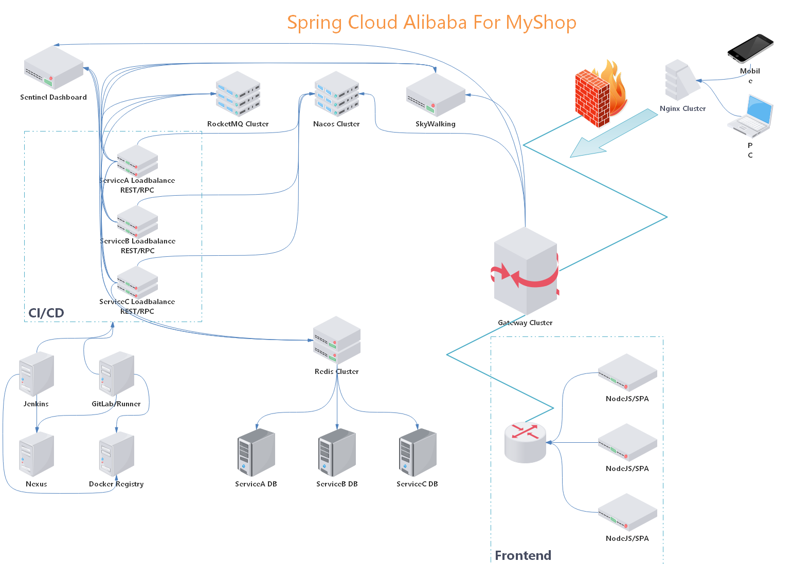

# Spring Cloud Alibaba For MyShop

利用 Spring Cloud Alibaba 微服务架构解决方案重构 [**走向单体地狱**](http://www.funtl.com/zh/guide/%E8%B5%B0%E5%90%91%E5%8D%95%E4%BD%93%E5%9C%B0%E7%8B%B1.html#%E8%A7%86%E9%A2%91%E5%90%88%E9%9B%86) 阶段开发的 MyShop 项目，以便于我们更好的理解微服务架构，将知识点运用到实践中。

## 开发环境

- 操作系统：Windows 10 Enterprise
- 开发工具：Intellij IDEA
- 数据库：MySQL 8.0.13
- Java SDK：Oracle JDK 1.8.152

## 部署环境

- 操作系统：Linux Ubuntu Server 16.04 X64
- 虚拟化技术：VMware + Docker

## 项目管理工具

- 项目构建：Maven + Nexus
- 代码管理：Git + GitLab
- 镜像管理：Docker Registry

## 后台主要技术栈

- 核心框架：Spring Boot + Spring Cloud Alibaba
- ORM 框架：tk.mybatis 简化 MyBatis 开发
- 数据库连接池：Alibaba Druid
- 数据库缓存：Redis Sentinel
- 消息中间件：RocketMQ
- 接口文档引擎：Swagger2 RESTful 风格 API 文档生成
- 全文检索引擎：ElasticSearch
- 分布式链路追踪：SkyWalking
- 分布式文件系统：Alibaba OSS
- 分布式系统网关：Spring Cloud Gateway
- 分布式协调系统：Spring Cloud Alibaba Nacos Server
- 分布式配置中心：Spring Cloud Alibaba Nacos Config
- 分布式熔断降级：Spring Cloud Alibaba Sentinel
- 反向代理负载均衡：Nginx

## 前后分离

- 前端框架：NodeJS + Vue + Axios
- 前端模板：iview

## 持续集成

- 持续集成：GitLab
- 持续交付：Jenkins

## 拓扑结构

## 服务规划

### Cloud

| 服务名称    | 服务端口         | 服务说明                               |
| --------------- | -------------------- | ------------------------------------------ |
| MySQL           | 192.168.10.150:3306  | MySQL 8.x，1G                             |
| GitLab          | 192.168.10.132:8080  | 代码托管/持续集成，2G             |
| Nexus           | 192.168.10.146:8081  | 依赖管理，2G                          |
| Docker Registry | 192.168.10.139:8080  | 镜像管理，1G                          |
| Jenkins         | 192.168.10.135:8080  | 持续交付，1G                          |
| SkyWalking      | 192.168.10.148:8080  | 链路追踪，2G                          |
| RocketMQ        | 192.168.10.149:8080  | 消息队列，2G                          |
|                 |                      | **以下四个服务在在同一台服务器，4G** |
| Nacos           | 192.168.10.151:8848  | 注册发现/配置中心                  |
| Sentinel        | 192.168.10.151:8080  | 熔断降级                               |
| Redis           | 192.168.10.151:26379 | 数据缓存                               |
| Nginx           | 192.168.10.151:80    | 反向代理/负载均衡                  |

### Services

| 服务名称                             | 服务端口 | 服务说明   |
| ---------------------------------------- | -------- | -------------- |
| **以下为通用服务**                       |          |                |
| myshop-service-gateway                   | 9000     | 服务网关 |
| myshop-service-reg                       | 9501     | 用户注册 |
| myshop-service-sso                       | 9502     | 单点登录 |
| myshop-service-cache                     | 9503     | 缓存服务 |
| myshop-service-oss                       | 9504     | 文件上传 |
| myshop-service-forget                    | 9505     | 忘记密码 |
| myshop-service-search                    | 9506     | 全文检索 |
| **以下为服务提供者**                     |          |                |
| myshop-service-provider-content-category | 10101    | 内容分类提供者 |
| myshop-service-provider-content          | 10102    | 内容服务提供者 |
| myshop-service-provider-item-cat         | 10103    | 商品分类提供者 |
| myshop-service-provider-item-desc        | 10104    | 商品详情提供者 |
| myshop-service-provider-item             | 10105    | 商品服务提供者 |
| myshop-service-provider-order            | 10106    | 订单服务提供者 |
| myshop-service-provider-order-item       | 10107    | 订单项提供者 |
| myshop-service-provider-order-shipping   | 10108    | 购物车提供者 |
| **以下为服务消费者**                     |          |                |
| myshop-service-consumer-content-category | 10201    | 内容分类消费者 |
| myshop-service-consumer-content          | 10202    | 内容服务消费者 |
| myshop-service-consumer-item-cat         | 10203    | 商品分类消费者 |
| myshop-service-consumer-item-desc        | 10204    | 商品详情消费者 |
| myshop-service-consumer-item             | 10205    | 商品服务消费者 |
| myshop-service-consumer-order            | 10206    | 订单服务消费者 |
| myshop-service-consumer-order-item       | 10207    | 订单项消费者 |
| myshop-service-consumer-order-shipping   | 10208    | 购物车消费者 |

### Frontend

规划中...